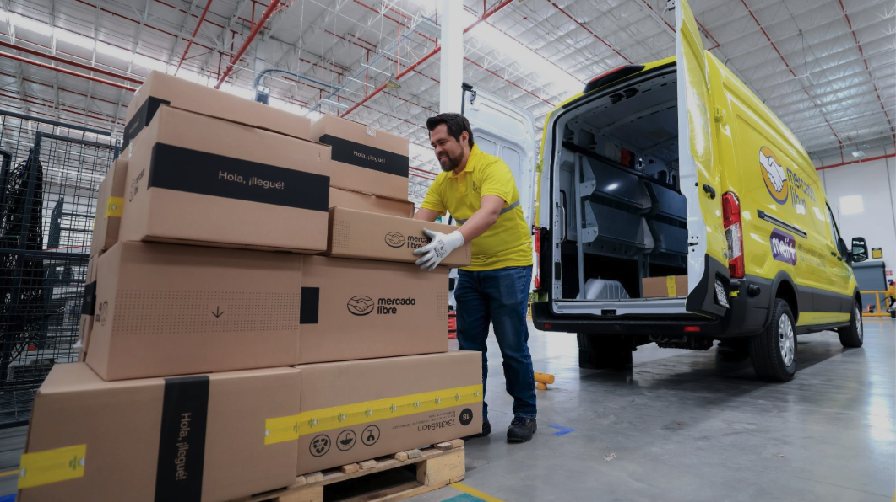
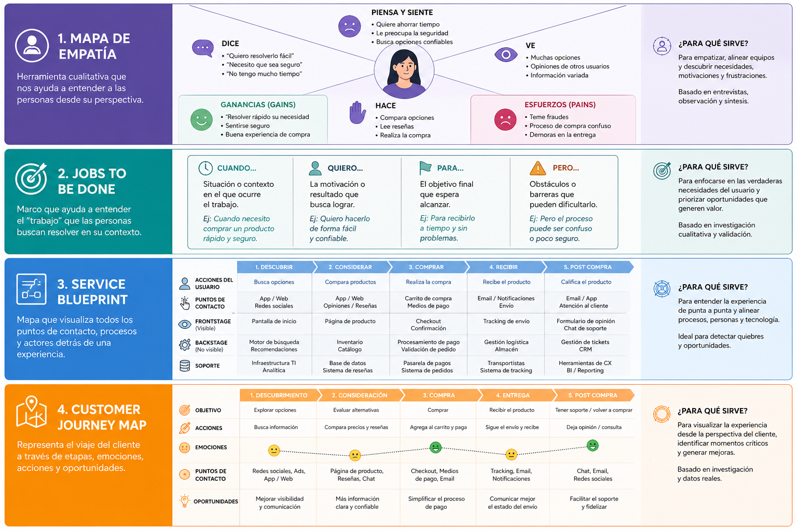
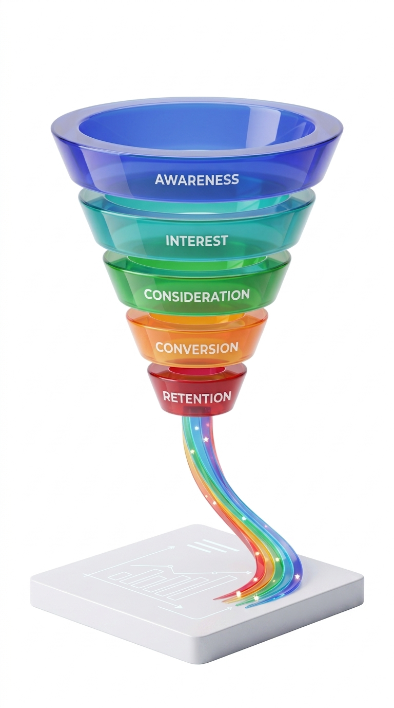
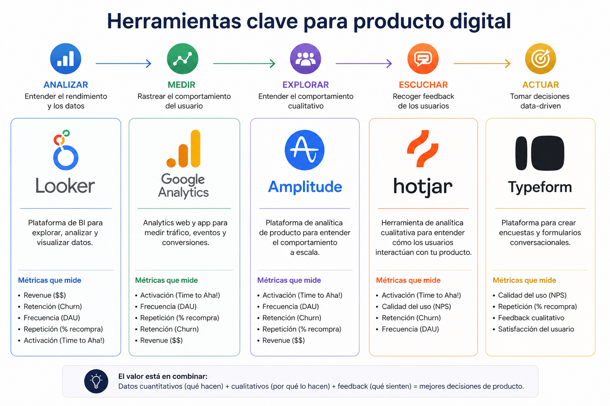

# Entender e influenciar  
## Cambiando el comportamiento   en productos digitales

**Juan Hernández-Serrato**  
Technology & Product Leader

---

# ¿Qué hago en el día a día?

- Conecto tecnología, negocio y ejecución
- Lidero equipos de producto (LatAm + China)  
- Defino e itero productos continuamente
- Analizo comportamiento real de usuarios (datos > opiniones)  

---

# Pregunta inicial

¿Cuántos han usado una app  
que prometía mucho…  
y la abandonaron en menos de una semana?

---

# Tesis

El éxito de un producto digital  
no depende solo de entender al usuario,

sino de diseñar sistemas  
que influyan su comportamiento.

---

# 1️⃣ Antes de construir

## Lo que creemos del usuario vs la realidad

- Lo que dice
- Lo que cree que hace
- Lo que realmente hace ❗

---

# Ejemplo real (Vendedores)

Vendedores dicen:  
“Quiero vender más”

Pero en la práctica:
- No adoptan fulfillment  
- No optimizan inventario  

👉 El problema no es intención  
👉 Es comportamiento

---

# Insight clave

No diseñamos para lo que el usuario dice.  
Diseñamos para cómo se comporta.

---

---

# 2️⃣ Durante la operación

## El producto empieza realmente aquí

---

# El funnel no es un funnel

No es:
- Adquisición
- Conversión
- Retención

Es:
- Fricción
- Incentivo
- Hábito

---

# Ejemplo real (Fulfillment)

Problema:

- Sellers no adoptaban fulfillment

No era awareness  
Era fricción:

- Costos percibidos  
- Complejidad operativa  
- Falta de confianza  

👉 Solución:

- Reducción de fricción operativa  
- Incentivos claros  
- Mejor visibilidad de beneficios  

Resultado:
- Incremento significativo en adopción

---

# Métricas que importan

- Revenue ($$)
- Activación (Time to Aha!)
- Repetición (% recompra)
- Frecuencia (DAU)
- Retención (Churn)
- Calidad del uso (NPS)

---

# Ejemplo real (Inventario)

Problema:

- Inventario disponible ≠ inventario útil

Insight:
- No todo el stock genera ventas

Acción:

- Optimización de assortment  
- Incentivos para inventario de alta rotación  

👉 Impacto:

- Mejora en profundidad de oferta  
y conversión

---

# Mentalidad clave

## Continuous Beta

- El producto nunca está terminado  
- Se aprende del comportamiento real  
- Se ajusta constantemente  

---

# Ejemplo real (Cross-border)

Al lanzar cross-border:

Suposición:

- Más oferta = más ventas  

Realidad:

- Usuarios no compraban igual  
- Fricciones en tiempos, confianza, percepción  

👉 Iteraciones:

- Ajustes en experiencia  
- Cambios en incentivos  
- Adaptación a comportamiento local  

---

---

# 3️⃣ Influenciar comportamiento

## No manipulamos   Diseñamos sistemas

---

# 5 palancas de influencia

| **Palanca** | **Descripción** |
| :--- | :--- |
| **Fricción** | Reducir o aumentar estratégicamente |
| **Incentivos** | Económicos o simbólicos |
| **Defaults** | Lo automático define comportamiento |
| **Feedback loops** | Inmediatez de respuesta |
| **Prueba social** | Lo que otros hacen importa |

---

# Ejemplo real (Pricing)

Problema:
- Sellers no optimizaban precios

Solución:
- Sugerencias automatizadas  
- Defaults inteligentes  
- Feedback inmediato  

👉 Resultado:
Cambio en comportamiento sin imponer reglas

---

# Ejemplo real (Growth)

Problema:
- Sellers no entendían cómo crecer

Solución:
- Visibilidad de métricas clave  
- Incentivos alineados  
- Feedback continuo  

👉 Resultado:
Mayor adopción de mejores prácticas

---

# Consideración clave

Influencia sin ética  
destruye confianza y marca

---

# Conexión con negocio

Cada decisión impacta:

- Crecimiento
- Costos
- Riesgo
- Velocidad

---

# Cierre

Si entiendes cómo se comportan  
tus usuarios en entornos digitales,

puedes diseñar sistemas  
que crecen de forma sostenible.

---

# Gracias

Preguntas?